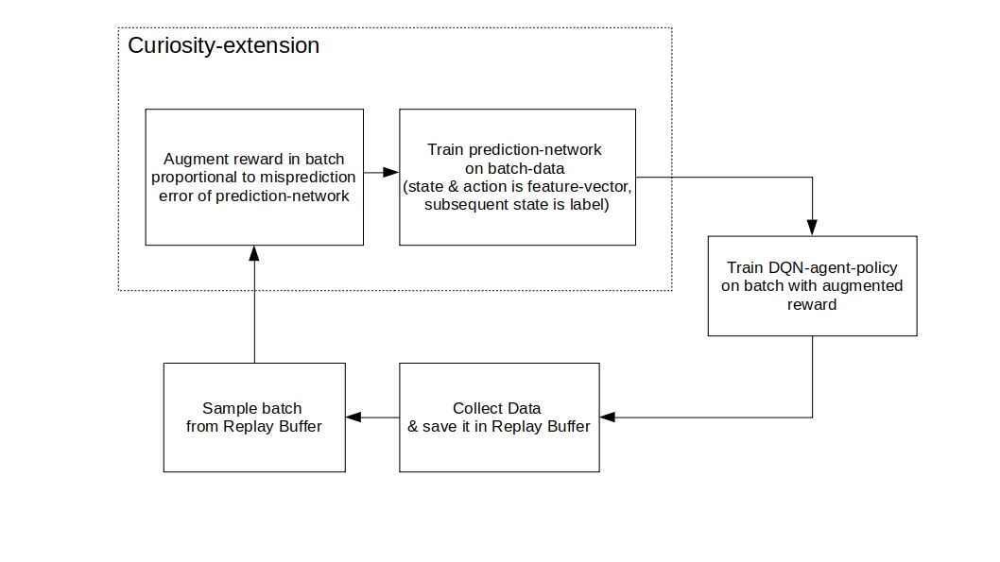
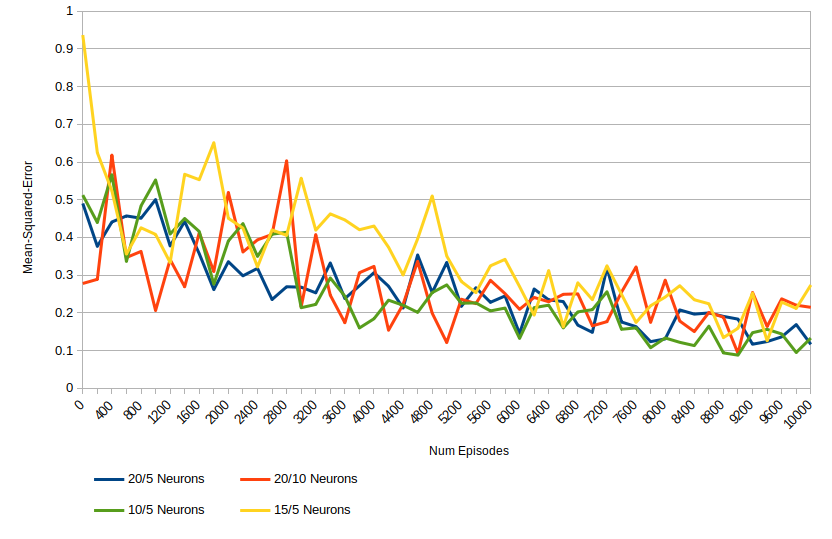
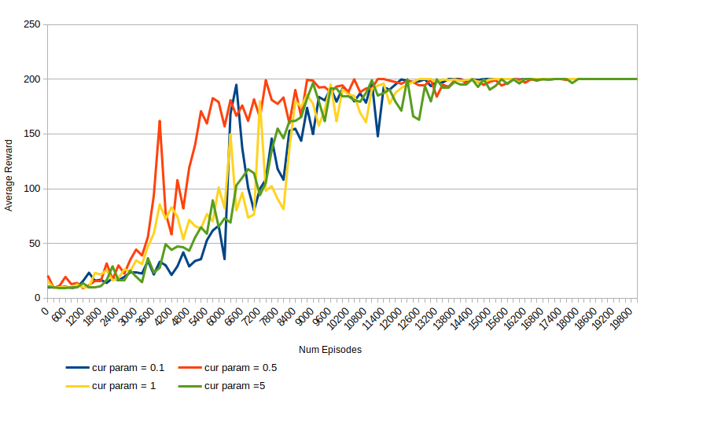
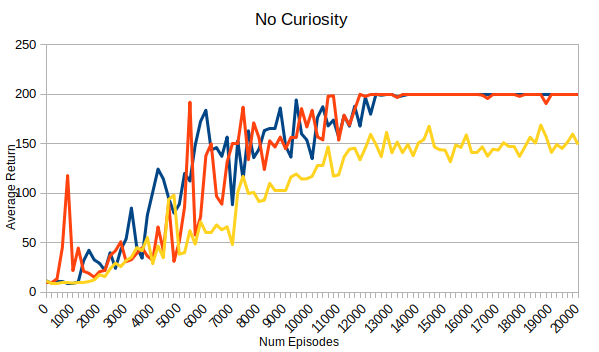
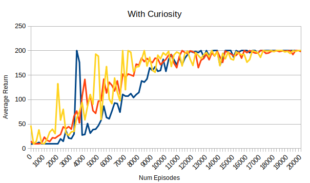

# Cartpole-Environment with an DQN-agent

This is a ```hello-world``` implementation for getting to know concepts of the tf-agents library and how to use curiosity in a setup like this.
The implementation is based on tf-agents [dqn-tutorial](https://github.com/tensorflow/agents/blob/master/docs/tutorials/1_dqn_tutorial.ipynb).

## Installation (on Ubuntu 18.04)
```
sudo apt-get install python-pip
pip install --upgrade pip
pip install -r requirements.txt
```
preferably in an virtual environment.

## Algorithm

In a nutshell, the sequence of subtasks for training the agent looks as follows:




## Technical Details

The implementation is based on the tf-agents library, which aims to facilitate the implentation of whole RL-setups.
Further details on the basic concepts can be found [here](https://github.com/tensorflow/agents).
It is possible to use the library with tensorflow 1 & 2, here tensorflow 2 was chosen.
For the construction of the RL-architecture and the training of the policy-network, the implementation follows the dqn-tutorial mentioned above.
The state-prediction network was created with the keras-library.
The code is marked by a mixture of comments of the tutorial and own thoughts, which helped me to build intuition for tf-agents.

## Experiments

In general curiosity it is more useful to apply curiosity when rewards are sparse.
Still, primarily for the purpose of learning to apply it in a RL setup and gaining some intuition on it's effects some experiments were performed.
Due to computational restrictions the parameter search was performed on a limited subspace.

### Parameter search

The first set of hyperparameters, which are investigated are modelcomplexity-parameters, e.g. number of neurons and number of layers.
The predictive model should have the ability to generalize on the data it sees during training.
Here are some experiments that show the mean-squared-error over time for different network architectures:



For further experiments 2 hidden layer, one with 10 and one with 5 neurons were chosen, because it capture the environmental dynamics sufficient in the experiments.

After fixing theses hyperparamters the curiosity-param is examined.
It is a proportionality value that is multiplied with the misprediction to obtain the additional reward signal.
Following data was observed with given model complexity:



The results led to using a curiosity-value of 0.5.

### Comparison to Baseline

To get an estimate on how well the curiosity-extended agent performs, it is compared against an DQN-agent, who learns without augmented reward:





It can be observed, that in both cases the agent has a high variance in its performance, which is a result of the data it sees during training.
The curiosity-based agent learns slightly faster, even though the difference is not significant.
Additionally the curiosity-agent is more experimental in its policy which can be especially seen when it reached the maximum score.
In contrast to the vanilla-agent it does not exploit its knowledge but still explores new state-action tuples.

In a dense reward setup like this curiosity is not necessary. The reward signal leads the agent to an sufficient policy to cope with the environment.
Also training time almost triples due to the additional trainingsteps and predictions of the prediction network.
Like the authors mentioned curiosity is a concept which should be applied in cases, where rewards are spase and/or not sufficient to achieve a desired agent-behavior.

