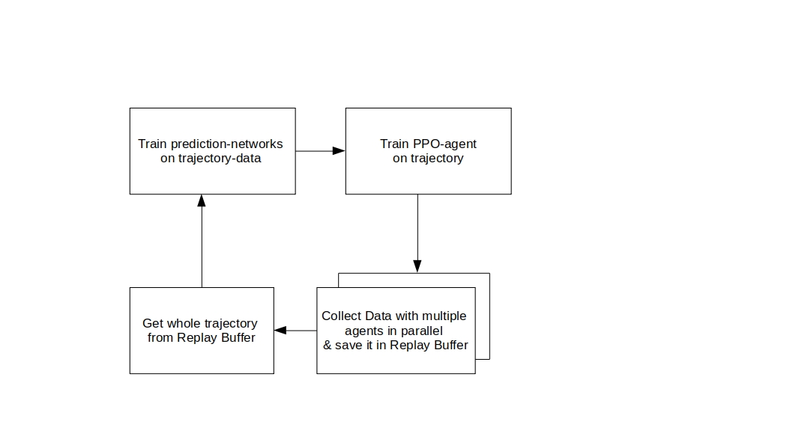
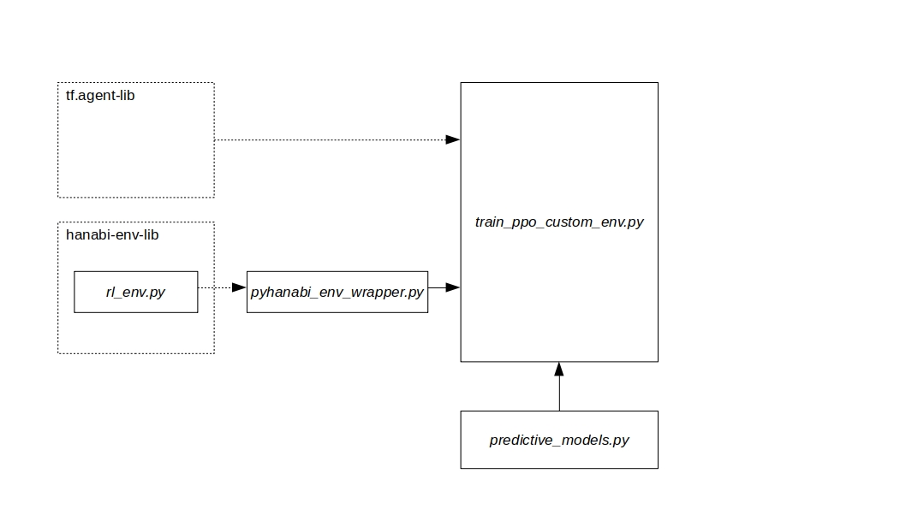
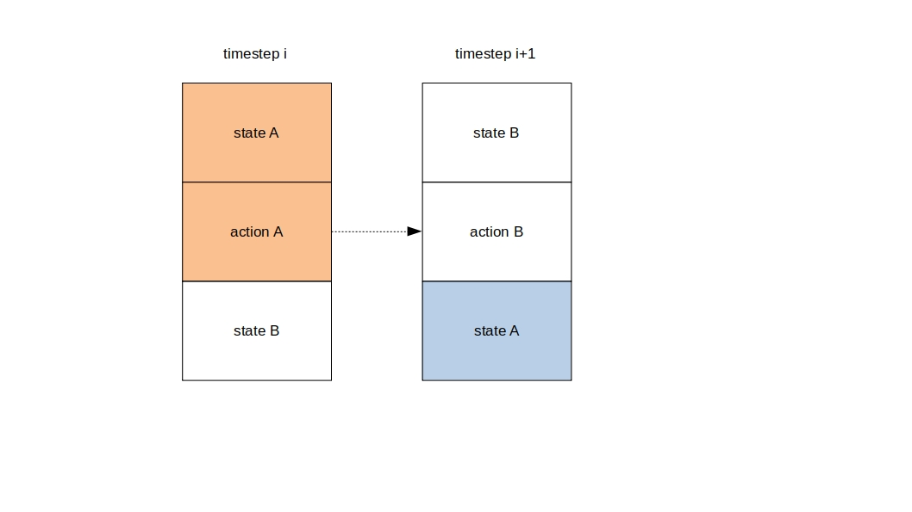
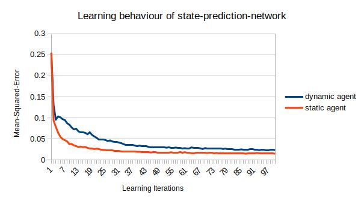
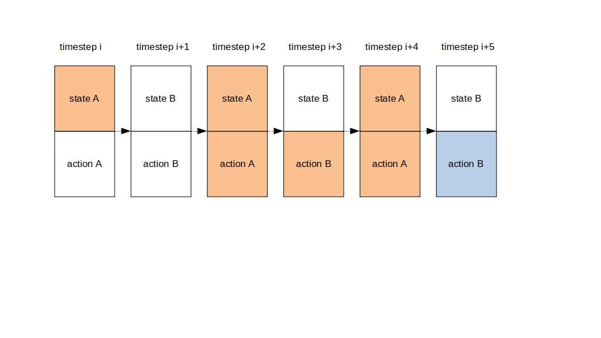
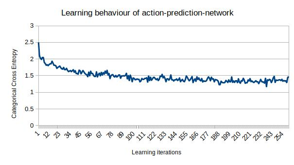

# Hanabi-Environment with multiple PPO-agents

The code is build on top of [this](https://github.com/hellovertex/hanabi/) ```custom_reward``` branch.

## Installation (on Ubuntu 18.04)
```
sudo apt-get install python-pip g++ cmake
pip install --upgrade pip
pip install -r requirements.txt
```
preferably in an virtual environment.

Next compile the environment
```
cd hanabi_learning_environment
cmake .
make
```
## Run PPO-Training
For running:
```
export PYTHONPATH="thisproject/Hanabi"
./startPPO.sh
```
For tensorboard-visualization:
```
export PYTHONPATH="thisproject/Hanabi"
./startTensorboard.sh
```
The directories in the scripts have to be changed to your environment in order to work.

## Training Algorithm

The high-level training algorithm looks similar to the one in the cartpole environment:



Here in contrast the trajectory is not augmented based on the misprediction error.
Also there is the possibility to train multiple agents in parallel to potentially speed up the training.

## Implementation Details

The software architecture is structured in following way:



The central file is ```train_ppo_custom_env.py```. Here the tf-agents library is included and the environment, the agent and the overall
workflow is assembled. To use the hanabi environment provided by [deepmind](https://github.com/deepmind/hanabi-learning-environment), it is
converted to the tf-agents-env by ```pyhanabi_env_wrapper.py```.
Classes for the predictive models are implemented in ```curiosity_reward.py```. In contrast to the overall RL-workflow, which is implemented with TF1, the predictive models were implemented with keras and are executed independently from the tf-graph.


## State-Prediction

To learn a environment dynamics the ```pyhanabi_env_wrapper.py``` was extended in a way that the observation at each time-step includes a vectorized state-representation of both agents. The PPO-agent only trains on it's own state-representation, but the forward model uses this extended observation to learn the consequences of an action in an given state.

These are the features (orange) and labels (blue) the prediction model is trained on:




### Experiments

The experiments were executed with a fixed model complexity.
The following figure shows the prediction error over time for a learning and a, in its policy, static PPO-agent:
The static agent was trained beforehand and reached an average score between 3 and 4 points in a two player setting.
Game parameters and model complexity can be looked up in the code.


It can be observed that the agent, with a non-static policy has more difficulties to learn the environment dynamics due to
encountering a wider range of states.
Building on this observation it could be investigated if a curiosity-implementation like in the cartpole environment is applicable in
an environment like hanabi.
Due to limited time a parameter search for the curiosity-param was not performed.
Nevertheless, the needed infrastructure to do so exists and is documented in the code.

## Action-Prediction

Besides the state-prediction-network an action-prediction-network was trained.
The associated features (orange) and labels (blue) are shown below.
The network computes an action distribution over all 11 possible actions via a softmax activation function.




### Experiments

The action-prediction-network has a higher variance in it's performance, which can be seen below, where averaged
loss values over time are shown.
For this experiment the agent had the same static policy as the static PPO-agent in the last experiment.



The prediction uncertainty (e.g. the entropy of the predicted distribution) could be used as a metric in future work.