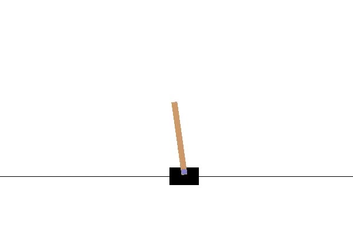
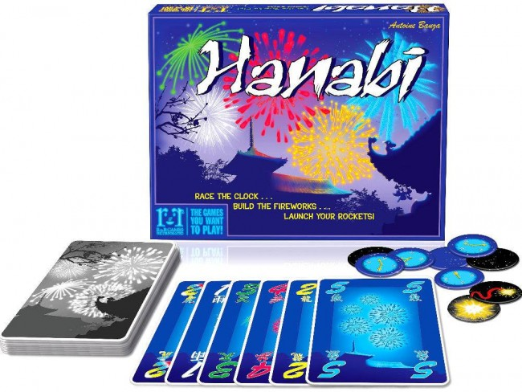

# State- & Actionprediction in Reinforcement Learning

## Curiosity-based Exploration in Cartpole

This first implementation is inspired from [this](https://pathak22.github.io/noreward-rl/) work.
Their approach extends the already existing external reward of the environment an by an additional intrinsic reward signal.
For this purpose, concurrently to the policy, an prediction network is trained, which takes an action and state and outputs the predicted next state. The intrinsic reward signal is then proportional to a loss between the actual subsequent state of the state-action pair and the prediction. Thus a high intrinsic reward signal indicates that the agent did not explore this state-action-subspace very well. Due to the intrinsic reward the agent is then motivated to do so.

Cartpole is an environment with a small action & state space (2 possible actions, 4D state space). 
It provides a uniform reward every timestep that the pole remains upright. Thus the reward signal is fairly dense.
Even though curisity is better applied in settings, where rewards are sparse, according to the authors,
this environment was chosen in order to gain some intuition about its effects and tf-agents library.

## Predictive Models in Hanabi

Hanabi is a more complex environment. It's a card game with the goal to discard as many fitting cards as possible. 
In this setup here there are two players, who can not see their own hand but the hand of the other player. 
Player A can give hints to player B about the state of his handcards, and vice versa.
This game in it's vanilla reward-setup offers very sparse reward: every correct card played generates one reward.

In order to obtain further metrics about game-states an state-prediction model and an action-prediction model were implemented.