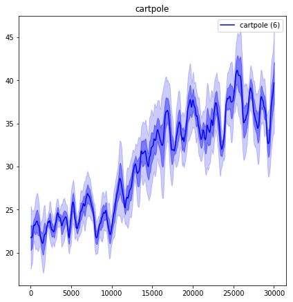
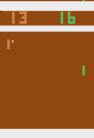
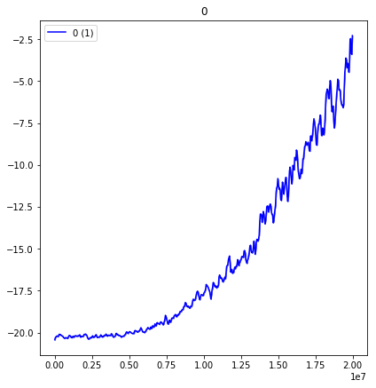
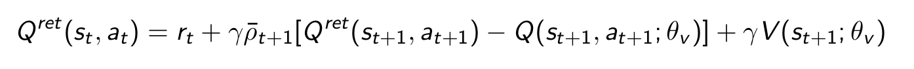
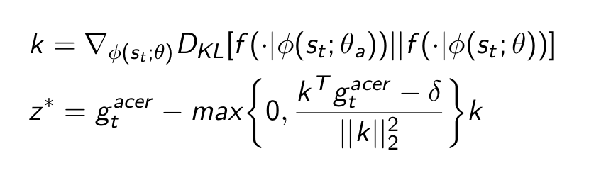

# A3C Acer Demo

This Implementation is based on the OpenAI Baselines implementation

Tested with Tensorflow 1.14
```bash
    pip install tensorflow==1.14
    pip install gym[atari]
```

### Instructions 

Instructions how to run the training can be found in the demonstration.ipynb notebook.
It is also possible to view a trained model.

### Example

The algorithm can be used for different Environments such as the CartPole-v0 or the MountainCar-v0




### Atari Environments

The training in Atari environments is possible but difficult. 
On the environment PongNoFrameskip-v4 it took about 16 hours on a 32-thread cpu to get close to the performance of the rule based pong ai. This pretrained model can be downloaded here https://drive.google.com/open?id=19PldQsUIw8lCs-Ox2ciPXObW59ZiyDTX.
This training is based on Vision with a convolutional neural network feeding into a fully connected network. 







### Implementation details


### Off-policy learning

During the Experience replay stage the algorithm uses a variant of the retrace algorithm, the function is implemented in baselines.acer.acer:

def q_retrace(R, D, q_i, v, rho_i, nenvs, nsteps, gamma):



### Trust Regions

The acer paper introduces efficient trust regions which are supposed to stabilize training. It is implemented in baselines.acer.acer beginning at line 155

k is a measure of the divergence of the current network with parameters θ and an average network with parameters θ<sub>a</sub>.

It does appear to reduce variance in reward for the cartpole-v0 Environment in the demonstration notebook. 



